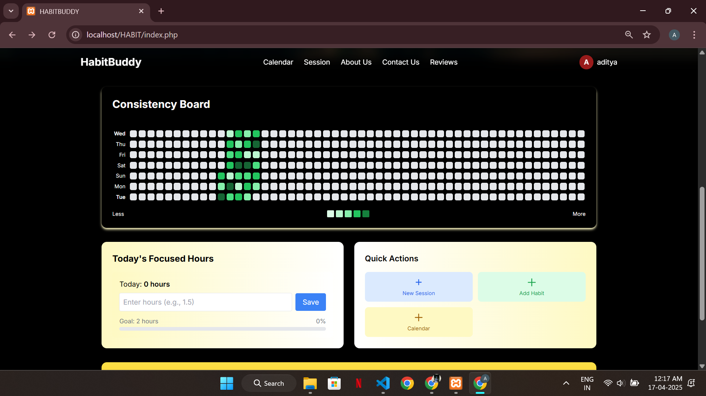
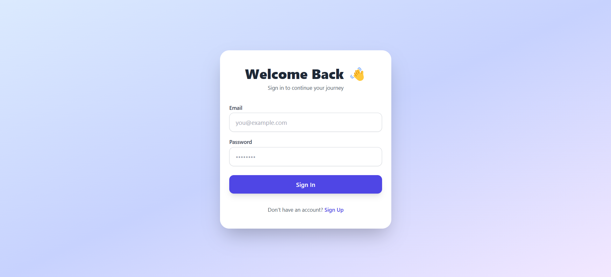
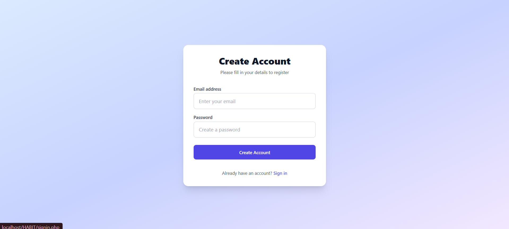
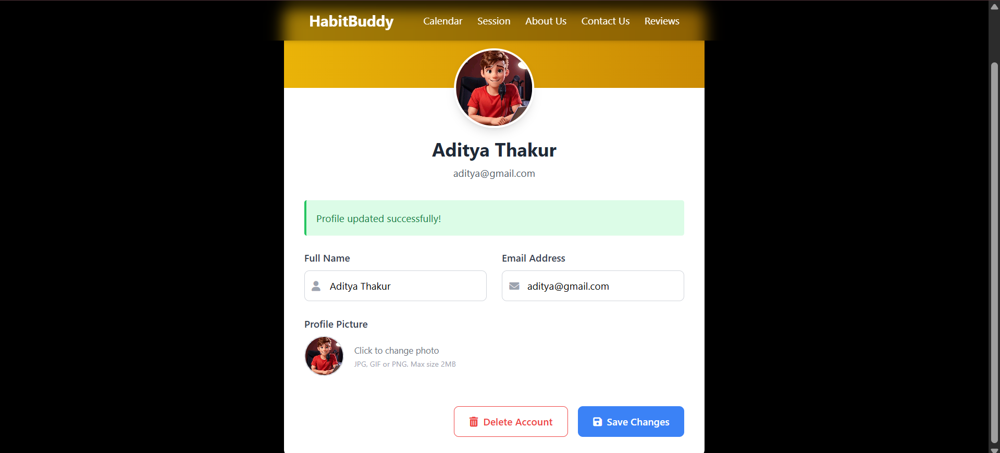
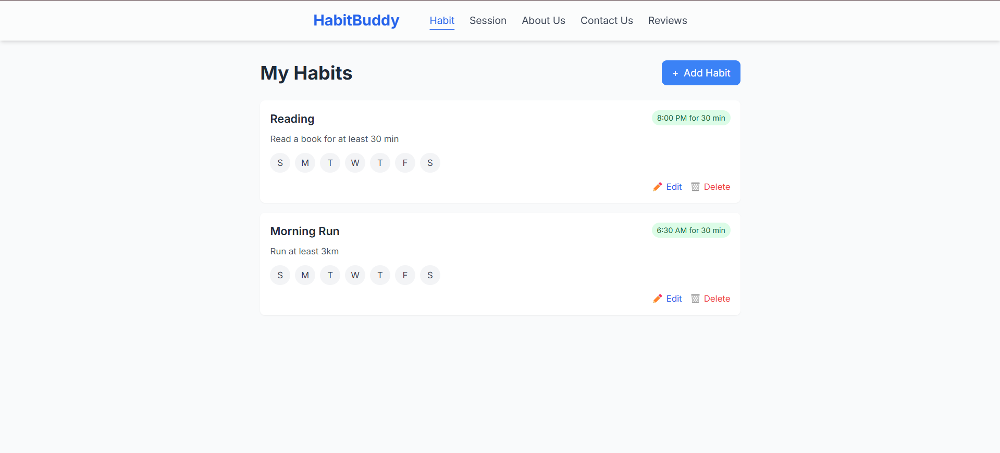
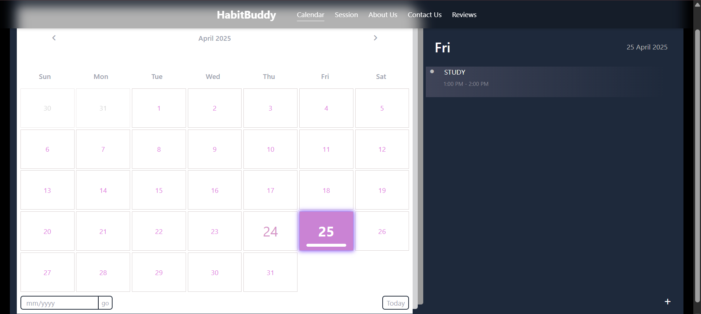
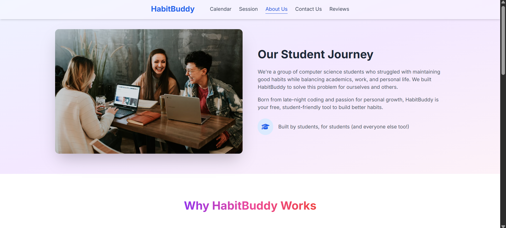
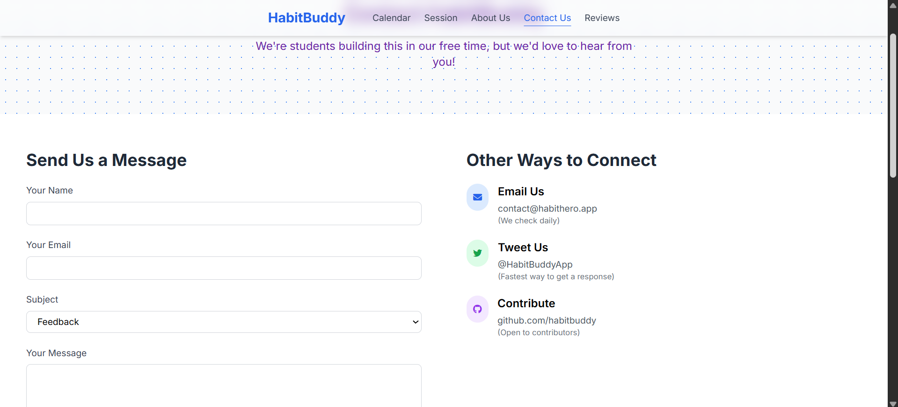
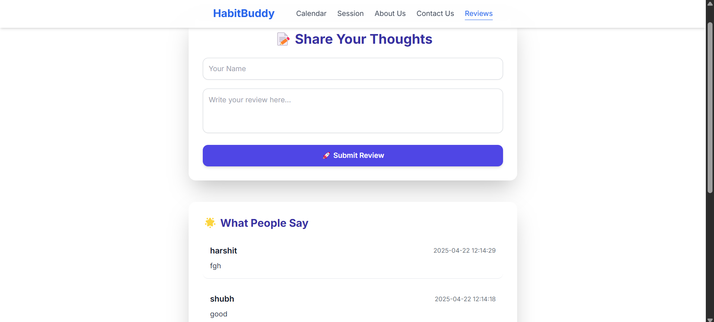

#🧠 HabitBuddy – 
📅Track Habits. ⏳Stay Consistent. 🛠️Build a Better You.
HabitBuddy is your personal habit-tracking companion designed to help you build, maintain, and succeed with consistent habits. From visual streak tracking to focused productivity sessions, everything is built to keep you on track.
🌟 Key Features
🔥 Streak Tracker with Heatmap – Visualize your consistency like GitHub contribution graphs.
📅 Habit Calendar – Add and manage habits on a personalized calendar.
⏰ Reminders & Sessions – Set reminders and initiate focused sessions based on user-defined hours.
🚫 Distraction Blocker – During sessions, users are prevented from switching tabs/windows.
👤 User Profile Page – Edit your name, email, photo, and more.
📝 Reviews Page – Leave feedback, read others' reviews, or delete your own.
📨 Contact Us – Reach out with questions, ideas, or support needs.
📖 About Us – Learn more about the team behind HabitBuddy.
⚙️ Tech Stack
•	HTML
•	CSS
•	JavaScript
•	PHP
🧭 Pages
•	Sign in
•	Sign up
•	Home
•	Profile
•	About Us
•	Contact Us
•	Calendar
•	Habits
•	Sessions
•	Reviews

